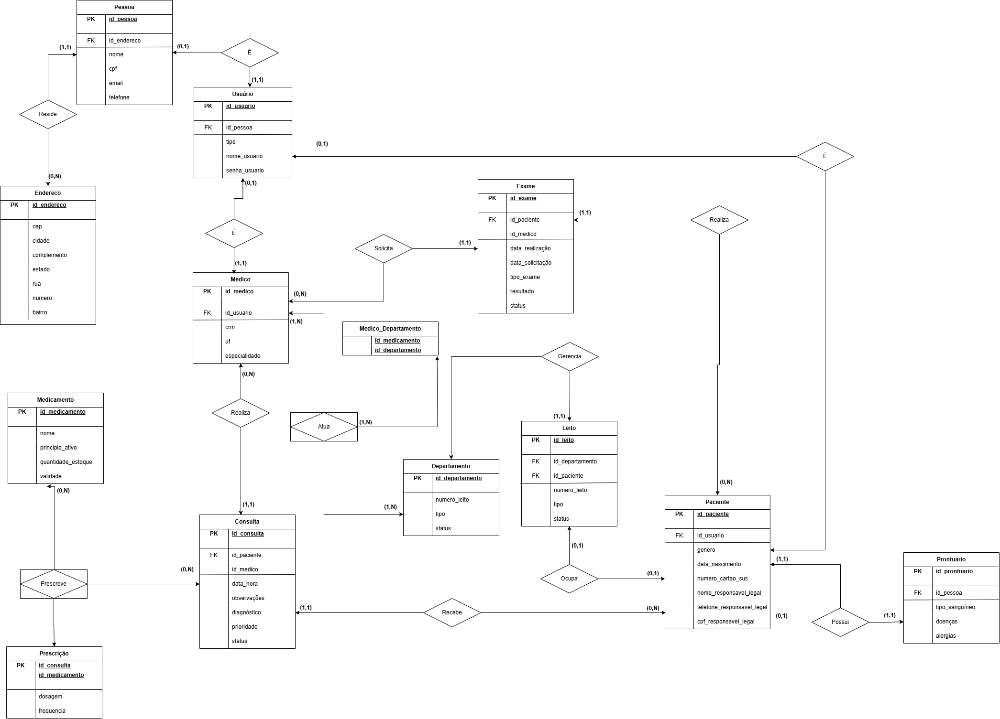

# 🚑 Projeto Final: Banco de Dados Relacional - Hospital Vitalis 🚑

Bem-vindo ao repositório do **Hospital Vitalis**, um projeto que simula um banco de dados relacional para um
pronto-socorro fictício.

---

## 🎯 Objetivo
Este repositório contém os scripts SQL desenvolvidos para modelar, inserir, manipular e consultar dados no **Hospital Vitalis**, um sistema de gestão hospitalar fictício. O objetivo é aplicar conceitos de banco de dados relacionais — como tabelas, consultas, transações e controle de acesso — em um cenário realista, demonstrando como informações críticas de saúde podem ser organizadas e gerenciadas eficientemente.


## 👥 Integrantes do Grupo

- Juliana Fernandes do Nascimento;
- Milenna Victória Assis Portella.

## 🌟 Tema Escolhido

O **Hospital Vitalis** é um pronto-socorro fictício, projetado para atender emergências 24/7. Este projeto simula seu
banco de dados, enfrentando desafios como o gerenciamento de leitos,
prescrições e exames em tempo real. Através da criação de tabelas, inserção de dados e controle de permissões,
foi explorado como um sistema relacional suporta operações críticas em um ambiente hospitalar dinâmico.

## 🛠️ Requisitos Técnicos

- **SGBD utilizado**: MySQL
- **Versão recomendada**: MySQL 8.0+ 
- **Ferramentas utilizadas**:
     - MySQL Workbench (para criação e execução dos scripts)
- **Como usar**:
     1. Instale o MySQL 8.0+ e o Workbench.
     2. Importe os scripts SQL disponíveis no repositório.
     3. Execute as consultas no ambiente configurado.

---

## 📊 Modelagem de Dados

### Diagrama Entidade-Relacionamento (DER)


### Entidades, Atributos e Relacionamentos

- O sistema foi modelado com base no diagrama ER. Abaixo, as entidades e seus atributos principais:
    - **Pessoa**: id_pessoa, id_endereco, nome, cpf, telefone e email;
    - **Endereço**: id_endereco, rua, numero, bairro, cidade, estado, cep e complemento;
    - **Médico**: id_medico, id_pessoa, crm, uf e especialidade;
    - **Paciente**: id_paciente, id_pessoa, data_nascimento, nome, gênero, celular, numero_cartao_sus,
      nome_responsavel_legal, telefone_responsavel_legal, cpf_responsavel_legal;
    - **Prontuário**: id_prontuario, id_paciente, alergias, doenças e tipo_sanguineo;
    - **Consulta**: id_consulta, id_medico, id_paciente, data_hora, diagnostico, observacoes e prioridade, status;
    - **Leito**: id_leito, id_departamento, id_paciente, numero_leito, tipo e status;
    - **Exame**: id_exame, id_paciente, id_medico, data_realizacao, data_solicitacao, tipo_exame, resultado, status;
    - **Medicamento**: id_medicamento, nome, principio_ativo, quantidade_estoque, validade;
    - **Usuário**: id_usuario, id_pessoa, tipo, nome_usuario e senha_usuario;
    - **Departamento**: id_departamento, numero_leito, tipo e status.

### Tabela de Relacionamentos

| Entidade 1         | Relacionamento | Entidade 2         | Explicação                                                                                                                                             | Tabela Associativa  |
|--------------------|----------------|--------------------|--------------------------------------------------------------------------------------------------------------------------------------------------------|---------------------|
| Pessoa (1,1)       | Reside         | Endereço (0,N)     | Cada pessoa tem exatamente um endereço, mas um endereço pode estar associado a zero ou mais pessoas.                                                   |                     |
| Pessoa (0,1)       | É              | Usuário (1,1)      | Nem toda pessoa é um usuário, mas todo usuário é exatamente uma pessoa.                                                                                |                     |
| Usuário (0,1)      | É              | Médico (1,1)       | Um usuário pode não ser médico, mas todo médico é exatamente um usuário.                                                                               |                     |
| Usuário (0,1)      | É              | Paciente (1,1)     | Um usuário pode não ser paciente, mas todo paciente é exatamente um usuário.                                                                           |                     |
| Paciente (1,1)     | Possui         | Prontuário (1,1)   | Cada paciente tem exatamente um prontuário, e cada prontuário está associado a exatamente um paciente, garantindo um registro único.                   |                     |
| Médico (0,N)       | Solicita       | Exame (1,1)        | Um médico pode solicitar zero ou mais exames, mas cada exame é solicitado por exatamente um médico.                                                    |                     |
| Paciente (0,N)     | Realiza        | Exame (1,1)        | Um paciente pode realizar zero ou mais exames, mas cada exame é realizado por exatamente um paciente.                                                  |                     |
| Médico (0,N)       | Realiza        | Consulta (1,1)     | Um médico pode realizar zero ou mais consultas, mas cada consulta é realizada por exatamente um médico.                                                |                     |
| Médico (1,N)       | Atua           | Departamento (1,N) | Cada médico atua em um ou mais departamentos, e cada departamento tem um ou mais médicos atuando, necessitando de uma tabela associativa.              | Médico_Departamento |
| Departamento (0,N) | Gerencia       | Leito (1,1)        | Um departamento pode gerenciar zero ou mais leitos, mas cada leito é gerenciado por exatamente um departamento.                                        |                     |
| Paciente (0,1)     | Ocupa          | Leito (0,1)        | Um paciente pode ocupar zero ou um leito, e um leito pode estar ocupado por zero ou um paciente, refletindo ocupação exclusiva.                        |                     |
| Paciente (0,N)     | Recebe         | Consulta (1,1)     | Um paciente pode receber zero ou mais consultas, mas cada consulta é recebida por exatamente um paciente.                                              |                     |
| Consulta (0,N)     | Prescreve      | Medicamento (0,N)  | Uma consulta pode prescrever zero ou mais medicamentos e um medicamento pode ser prescrito em zero ou mais consultas, exigindo uma tabela associativa. | Prescrição          |

---
## 🧠 Normalização

O banco de dados foi normalizado até a **Terceira Forma Normal (3NF)** ✅, com o objetivo de eliminar redundâncias, garantir integridade dos dados e facilitar a manutenção do sistema hospitalar 🏥.


### 🔎 Justificativas das Formas Normais Aplicadas

#### 🥇 **1ª Forma Normal (1NF)**
- **Objetivo:** Eliminar grupos repetitivos e garantir que todos os atributos contenham valores atômicos (indivisíveis).
- **Aplicação no projeto:**
     - Todos os atributos possuem **valores atômicos**, sem listas ou campos compostos.
     - **Exemplo:** a tabela `Endereço` separa rua, número, bairro etc., evitando dados agrupados.

#### 🥈 **2ª Forma Normal (2NF)**
- **Objetivo:** Eliminar dependências parciais em relação a chaves primárias compostas.
- **Aplicação no projeto:**
     - Cada atributo **não-chave** depende da **chave primária completa**.
     - **Exemplo:** a tabela `Prescrição` usa como chave composta (`id_consulta`, `id_medicamento`) e os campos `dosagem` e `frequência` dependem dessa combinação.

#### 🥉 **3ª Forma Normal (3NF)**
- **Objetivo:** Eliminar dependências transitivas entre atributos.
- **Aplicação no projeto:**
     - Todos os atributos **dependem diretamente da chave primária** 🎯.
     - **Exemplo:** a tabela `Paciente` armazena dados do responsável diretamente relacionados ao paciente, e não a outro campo.


### 💡 Exemplos de Normalização no Projeto

| Etapa | Antes da Normalização ❌ | Depois da Normalização ✅ |
|-------|---------------------------|----------------------------|
| 1NF   | Tabela `Consulta` com campo `medicamentos_prescritos` como lista de nomes 📃 | Separação da tabela `Prescrição`, com uma linha por medicamento 💊 |
| 2NF   | Tabela `Prescrição` com `dosagem` ligada apenas ao `medicamento` 🔗 | `dosagem` depende da combinação `consulta + medicamento` 🧾 |
| 3NF   | Tabela `Paciente` com `bairro`, `cidade`, `estado` misturados 🏘️ | Criação da tabela `Endereço`, com `id_endereco` referenciado por `Pessoa` 🗂️ |

---

## 🗃️ Scripts SQL

Todos os scripts que compõem a base de dados do Hospital Vitalis estão localizados na pasta `/sql`, separados por função para facilitar a organização, leitura e execução.

---

### Para iniciar:
  - 1º Passo: Crie o Banco de Dados
  ```sql
  CREATE DATABASE hospital_vitalis; 
  ```
  - 2º Passo: Selecione o Banco de Dados para que as próximas alterações ocorram dentro dele
  ```sql
  USE hospital_vitalis; 
  ```

  - 3º Passo: Execute os códigos sql

---
### 🔧 DDL – *Data Definition Language*

📄 **Caminho:** `sql/ddl.sql`

Este script define toda a estrutura do banco de dados:

- Criação das tabelas (como `Pessoa`, `Paciente`, `Consulta`, `Leito`, etc.);
- Definição das chaves primárias e estrangeiras;
- Regras de integridade referencial (`ON DELETE` e `FOREIGN KEY`).

⚙️ **Exemplo:**  
Criação da tabela `Paciente` com vínculo a `Usuario` e dados pessoais adicionais.

---

### ✍️ DML – *Data Manipulation Language*

📄 **Caminho:** `sql/dml.sql`

Esse arquivo insere e manipula dados nas tabelas já criadas, simulando o uso real do sistema:

- Inserção de endereços, pacientes, médicos, consultas, exames, medicamentos, etc.;
- Atualizações em registros como mudança de status de leito ou consulta;
- Exclusão de registros para simulação de testes.

📌 **Exemplo:**  
Atualizar o status de um leito para "Livre" após alta de um paciente.

---

### 🔎 DQL – *Data Query Language*

📄 **Caminho:** `sql/dql.sql`

Contém consultas SQL para obter informações específicas do sistema:

- Pacientes com consultas pendentes, separados por especialidade médica;
- Revisar histórico de pacientes;
- Medicamentos com baixa quantidade em estoque.

📊 **Exemplo:**  
Consulta para listar pacientes com alergias registradas no prontuário.

---

### 🔐 DCL – *Data Control Language*

📄 **Caminho:** `sql/dcl.sql`

Gerencia permissões de acesso ao sistema, controlando usuários e o que podem visualizar ou editar:

- Criação de usuários (como médicos, enfermeiros, recepcionistas);
- Concessão de privilégios com `GRANT`;
- Revogação e exclusão de usuários com `REVOKE` e `DROP USER`.

🔑 **Exemplo:**  
O médico "Rafael Santos" recebe permissão para registrar consultas e exames.

---

### 🔁 DTL – *Data Transaction Language*

📄 **Caminho:** `sql/dtl.sql`

Contém procedimentos que utilizam transações para garantir a integridade em operações sensíveis:

- Uso de `START TRANSACTION`, `COMMIT` e `ROLLBACK`;
- Validação de condições antes de concluir ou desfazer operações;
- Pode ser expandido com `SAVEPOINT` se necessário.

🧪 **Exemplos incluídos:**

- Registrar consulta com prescrição apenas se houver estoque do medicamento;
- Impedir cadastro de consulta com prioridade inválida;
- Ocupação de leito após consulta com validação condicional.

---

## 📒 Documentação (ABNT)

A documentação completa está disponível na pasta `/documentacao`, estruturada conforme as normas da ABNT, contendo:

- Introdução
- Modelagem conceitual e lógica
- Scripts comentados
- Conclusão e referências

📄 **Caminho:** `documentacao/projeto-final.pdf`

